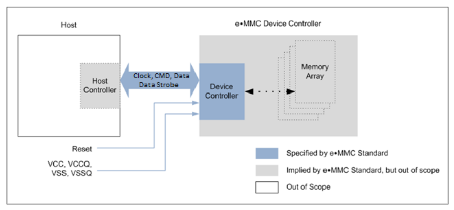
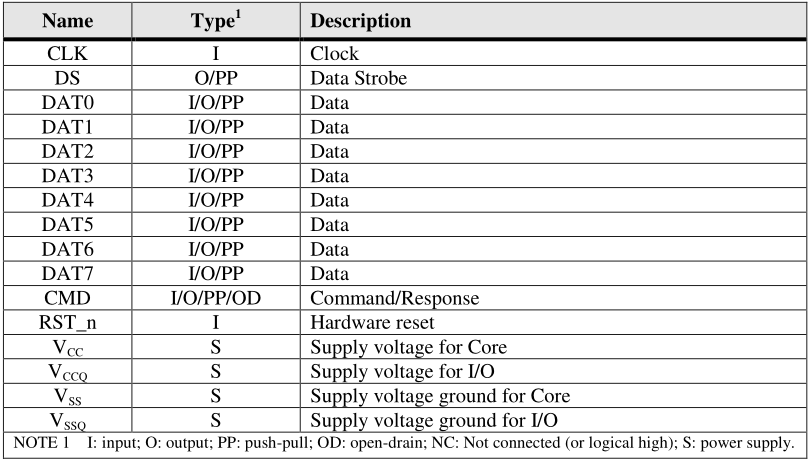
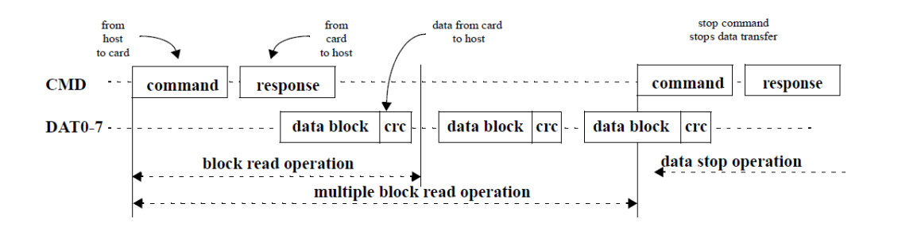

## 系统特性
### 系统电压范围

|                     | High Voltage | Dual Votage                 |
| :-----------------: | :----------: | :-------------------------: |
| Communication(Vccq) | 2.7 – 3.6    | 1.1-1.3, 1.70-1.95, 2.7-3.6 |
| Memory Access(Vcc)  | 2.7 – 3.6    | 1.70-1.95, 2.7-3.6          |

注意3.3v的电压可能不支持hs200或hs400模式的设备

### emmc共有11根线, 包括时钟, 数据同步信号, 1位的命令和8位的数据线, 同时支持硬件复位
* 时钟频率的范围在0到200Mhz之间
* 一共支持三种不同的总线模式: 单线(缺省配置), 四线和八线

### 数据保护机制
* 密码
* 永久且不可逆转，一旦保护不可再写
* 数据保护随着掉电重置
* 临时可配置的, 可随时被使能或关闭

### 数据移除命令
* Erase
* Trim
* Sanitize

### 支持突然断电的数据保护

### 具有定制解决方案的能力

### 省电休眠模式

### 增强主机和设备的通信技术, 提高性能
* 关机通知
* 高优先级中断(HPI)
* 后台操作
* 分区
* 强化区域
* 实时时钟
* 分区属性
* 内容管理
* 系统数据管理
* 成套的命令
* 动态设备容量
* 可选的易失性高速缓存
* 封装外壳温度
* 命令队列
* 增强的数据同步 

### 使用启动分区可以自动传输数据

### 支持用签名访问受保护的存储块

### 两种大容量设备: 512B 小扇区设备和 4KB 大扇区设备

## EMMC系统与设备

### EMMC系统总览

e-MMC 规范涵盖了接口和设备控制器的行为。作为该规范的一部分，隐含了主机控制器和内存存储阵列的存在，但这些部分的操作并未完全明确.

  
  
系统总览图

### 存储容量

对于v4.1之前的版本, emmc只支持32位，所以允许emmc的最大容量为2GB
对于v4.1之后的版本, emmc在之前按字节寻址的基础上, 支持按扇区寻址(每个扇区大小为512B), 之后容量只要大于2GB的设备都应该采用按扇区寻址
要确定使用的寻址模式, 主机应读取 OCR 寄存器中的位 [30:29].

### e-MMC 设备总览
e-MMC 设备通过可配置的数据总线信号传输数据, 通信信号包括:

* 时钟(clk): 该信号的每个周期在命令上指示一个比特的传输, 在所有数据线上指示一个比特（1x）或两个比特（2x）的传输, 频率可在零和最大时钟频率之间变化.
* 数据选通(data strobe): 该信号由设备生成, 用于HS400模式, 对于数据输出, 该信号的每个周期指示数据的两个比特传输（2x）- 一个比特用于正边沿，另一个比特用于负边沿. 对于 CRC 状态响应输出和 CMD 响应输出(仅在 HS400 增强选通模式下启用), CRC 状态和 CMD 响应仅在正边沿锁存, 负边沿不锁存.
* 命令: 该信号是一个双向信号, 用于设备初始化和命令传输, CMD 信号有两种工作模式: 开漏用于初始化模式, 推挽用于快速命令传输. 命令从 e-MMC 主控制器发送到 e-MMC 设备, 响应从设备发送到主机.
* 数据(DATA0-DATA7):这些都是双向数据通道, DAT 信号以推挽模式工作. 每次只有设备或主机驱动这些信号, 默认情况下, 上电或复位后, 只有 DAT0 用于数据传输. e-MMC 主机控制器可使用 DAT0-DAT3 或 DAT0-DAT7 为数据传输配置更宽的数据总线, e-MMC 器件包含数据线 DAT1-DAT7 的内部上拉, 进入 4 位模式后, 设备会立即断开 DAT1、DAT2 和 DAT3 线的内部上拉, 相应地进入 8 位模式后, 设备会立即断开 DAT1-DAT7 线的内部上拉.

e-MMC 的接口如下图所示:

  
  
e-MMC 接口

每个都会有一组信息寄存器, 如下图所示, 后续会详细说明.

|        名称         | 位宽(bytes)  |          描述                                                               | 是否必须 |
| :-----------------: | :----------: | :-------------------------------------------------------------------------: | :------: |
|        CID          |    16        | 设备识别码, 每个设备独立编号                                                | 是       |
|        RCA          |    2         | 相对设备地址, 是设备的系统地址, 在驱动初始化过程中动态分配                  | 是       |
|        DSR          |    2         | 驱动等级寄存器, 用于配置设备的输出驱动                                      | 可选     |
|        CSD          |    16        | 设备特定信息, 有关设备运行状况的信息                                        | 是       |
|        OCR          |    4         | 运行条件寄存器, 通过特殊广播命令获取设备的电压类型                          | 是       |
|        EXT_CSD      |    512       | 扩展设备特定数据， 包含有关设备功能和所选模式的信息， 在第 4.0 版标准中引入 | 是       |

主控可通过以下三种方式重置设备:

* 关闭并重新开启电源, 设备有自己的开启检测电路, 在接通电源后进入规定状态.
* 复位信号
* 发送特殊命令(CMD0)

#### 总线协议

在重新上电后, 主机会通过一些基于e-MMC总线协议的特定的信息对设备进行初始化, 每个信息可以是如下其中之一的标志:

* 命令: 命令是开始一个操作的标志, 它往往被从主机端发往设备, 通过命令线传输.
* 响应: 响应是从设备端发往主机端的, 是对先前设备所接收到命令的回应的标志.
* 数据: 数据可以从主机端发往设备端，也可以从设备端发往主机端, 通过数据线传输, 数据线共有8条, 目前支持单线, 四线和八线模式.

对于每条数据线来说, 数据在被传输的时候可以是每个时钟周期一个bit(SDR)或者每个时钟周期两个bit(DDR).

设备地址被记录在内存中, 在初始化阶段用来让总线控制器连接设备, 设备通过CID进行认证, 每个设备都有一个独立的CID码, 为了确保CID的独立性，CID寄存器共有24bit(后续会详述),被JEDEC/MMCA协会规范其内容, 每个设备厂商需要向协会申请独立的CID码(具体来说是独立和MID和可选的OID).

e-MMC 总线数据传输由命令、响应和数据块结构标志组成, 一次数据传输就是一次总线操作, 操作总是包含一个命令和一个响应标志, 此外, 有些操作还包含数据标志.

e-MMC 命令是面向数据块的命令: 这些命令发送一个数据块, 通过CRC进行校验, 读写操作允许单块或多块传输, 与顺序读取类似, 当CMD线上出现停止命令时, 多数据块传输将被终止.

  
  
e-MMC 单/多块读

